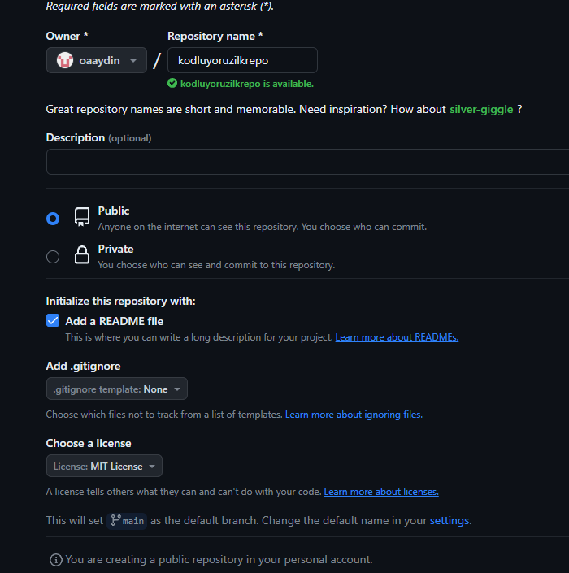

# kodluyoruzilkrepo
Bu repo 
[Kodluyoruz](https://www.kodluyoruz.org/) Front-End Eğitiminde oluşturduğumuz ilk repo. İçerisinde bir adet README dosyası, bir adet de index.html barındırıyor.

## Installation
Öncelikle projeyi clonelayın.
> 
 git clone https://github.com/oaaydin/kodluyoruzilkrepo.git 

## Usage 
Projeyi cloneladıktan sonra Visual Studio Code programında açınız 
Linux için:
>cd kodluyoruzilkrepo  
code .

## Contributing 
Pull requestler kabul edilir. Büyük değişiklikler için, lütfen önce neyi değiştirmek istediğinizi tartışmak için bir konu açınız.

## License

[MIT](https://choosealicense.com/licenses/mit/)